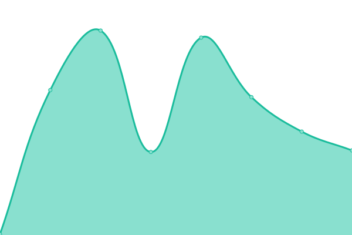

# [📈 Live Status](https://uptime.jimbrig.com): <!--live status--> **🟩 All systems operational**

This repository contains the open-source uptime monitor and status page for [Jimmy Briggs](https://www.linkedin.com/in/jimbrig), powered by [Upptime](https://github.com/upptime/upptime).

With [Upptime](https://upptime.js.org), you can get your own unlimited and free uptime monitor and status page, powered entirely by a GitHub repository. We use [Issues](https://github.com/jimbrig/upptime/issues) as incident reports, [Actions](https://github.com/jimbrig/upptime/actions) as uptime monitors, and [Pages](https://uptime.jimbrig.com) for the status page.

<!--start: status pages-->
<!-- This summary is generated by Upptime (https://github.com/upptime/upptime) -->
<!-- Do not edit this manually, your changes will be overwritten -->
<!-- prettier-ignore -->
| URL | Status | History | Response Time | Uptime |
| --- | ------ | ------- | ------------- | ------ |
|  [KaaS - Obsidian Publish](https://publish.obsidian.md/kaas-published/) | 🟩 Up | [kaa-s-obsidian-publish.yml](https://github.com/jimbrig/upptime/commits/HEAD/history/kaa-s-obsidian-publish.yml) | 

 467ms
     
 | 

<a href="https://uptime.jimbrig.com/history/kaa-s-obsidian-publish">100.00%</a>
    

|  [KaaS - GitHub Pages](https://kaas.jimbrig.com) | 🟩 Up | [kaa-s-git-hub-pages.yml](https://github.com/jimbrig/upptime/commits/HEAD/history/kaa-s-git-hub-pages.yml) | 

 193ms
     
 | 

<a href="https://uptime.jimbrig.com/history/kaa-s-git-hub-pages">100.00%</a>
    

|  [Devfolio](https://devfolio.jimbrig.com) | 🟩 Up | [devfolio.yml](https://github.com/jimbrig/upptime/commits/HEAD/history/devfolio.yml) | 

 147ms
     
 | 

<a href="https://uptime.jimbrig.com/history/devfolio">100.00%</a>
    

|  [GitHub Profile](https://github.com/jimbrig) | 🟩 Up | [git-hub-profile.yml](https://github.com/jimbrig/upptime/commits/HEAD/history/git-hub-profile.yml) | 

 731ms
     
 | 

<a href="https://uptime.jimbrig.com/history/git-hub-profile">100.00%</a>
    

|  [Clip2Mark](https://clip2mark.jimbrig.com) | 🟩 Up | [clip2-mark.yml](https://github.com/jimbrig/upptime/commits/HEAD/history/clip2-mark.yml) | 

 137ms
     
 | 

<a href="https://uptime.jimbrig.com/history/clip2-mark">100.00%</a>
    

|  [GitHub Issues App](https://github-issues.jimbrig.com) | 🟩 Up | [git-hub-issues-app.yml](https://github.com/jimbrig/upptime/commits/HEAD/history/git-hub-issues-app.yml) | 

 215ms
     
 | 

<a href="https://uptime.jimbrig.com/history/git-hub-issues-app">100.00%</a>
    

|  [JimsDocs](https://jimsdocs.jimbrig.com) | 🟩 Up | [jims-docs.yml](https://github.com/jimbrig/upptime/commits/HEAD/history/jims-docs.yml) | 

 144ms
     
 | 

<a href="https://uptime.jimbrig.com/history/jims-docs">100.00%</a>
    

<!--end: status pages-->

[**Visit our status website →**](https://uptime.jimbrig.com)

## 📄 License

- Powered by: [Upptime](https://github.com/upptime/upptime)
- Code: [MIT](./LICENSE) © [Jimmy Briggs](https://www.linkedin.com/in/jimbrig)
- Data in the `./history` directory: [Open Database License](https://opendatacommons.org/licenses/odbl/1-0/)
