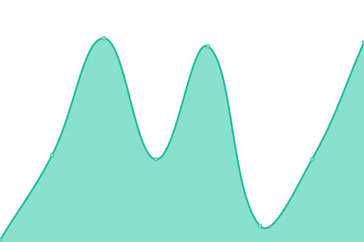
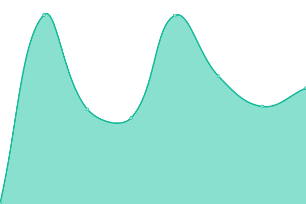
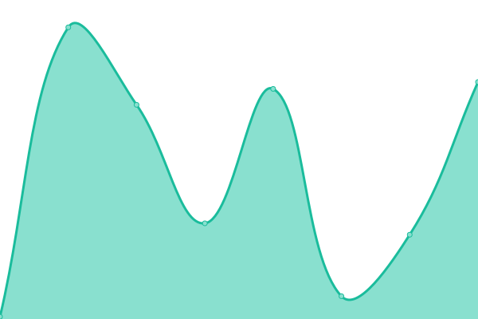
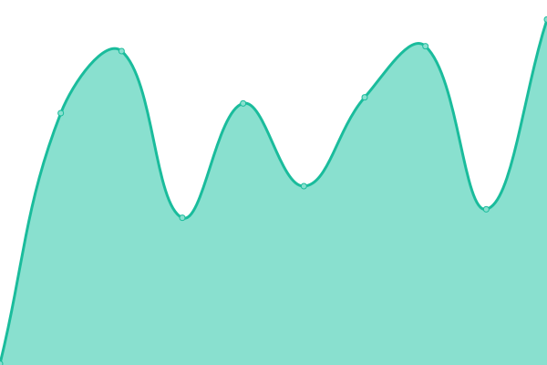

# [📈 Live Status](https://uptime.jimbrig.com): <!--live status--> **🟧 Partial outage**

This repository contains the open-source uptime monitor and status page for [Jimmy Briggs](https://www.linkedin.com/in/jimbrig), powered by [Upptime](https://github.com/upptime/upptime).

With [Upptime](https://upptime.js.org), you can get your own unlimited and free uptime monitor and status page, powered entirely by a GitHub repository. We use [Issues](https://github.com/jimbrig/upptime/issues) as incident reports, [Actions](https://github.com/jimbrig/upptime/actions) as uptime monitors, and [Pages](https://uptime.jimbrig.com) for the status page.

<!--start: status pages-->
<!-- This summary is generated by Upptime (https://github.com/upptime/upptime) -->
<!-- Do not edit this manually, your changes will be overwritten -->
<!-- prettier-ignore -->
| URL | Status | History | Response Time | Uptime |
| --- | ------ | ------- | ------------- | ------ |
|  [Property Allocation WebApp](https://propertyallocation.jimbrig.com/) | 🟥 Down | [property-allocation-web-app.yml](https://github.com/jimbrig/upptime/commits/HEAD/history/property-allocation-web-app.yml) | 

 201ms
     
 | 

<a href="https://jimbrig.github.io/upptime/history/property-allocation-web-app">0.00%</a>
    

|  [KaaS - Obsidian Publish](https://publish.obsidian.md/kaas-published/) | 🟩 Up | [kaa-s-obsidian-publish.yml](https://github.com/jimbrig/upptime/commits/HEAD/history/kaa-s-obsidian-publish.yml) | 

 538ms
     
 | 

<a href="https://jimbrig.github.io/upptime/history/kaa-s-obsidian-publish">100.00%</a>
    

|  [KaaS - GitHub Pages](https://kaas.jimbrig.com) | 🟩 Up | [kaa-s-git-hub-pages.yml](https://github.com/jimbrig/upptime/commits/HEAD/history/kaa-s-git-hub-pages.yml) | 

 228ms
     
 | 

<a href="https://jimbrig.github.io/upptime/history/kaa-s-git-hub-pages">100.00%</a>
    

|  [Projects Site](https://docs.jimbrig.com/projects/) | 🟩 Up | [projects-site.yml](https://github.com/jimbrig/upptime/commits/HEAD/history/projects-site.yml) | 

 179ms
     
 | 

<a href="https://jimbrig.github.io/upptime/history/projects-site">100.00%</a>
    

|  [Devfolio](https://docs.jimbrig.com/devpholio/) | 🟩 Up | [devfolio.yml](https://github.com/jimbrig/upptime/commits/HEAD/history/devfolio.yml) | 

 43ms
     
 | 

<a href="https://jimbrig.github.io/upptime/history/devfolio">100.00%</a>
    

|  [GitHub Profile](https://github.com/jimbrig) | 🟩 Up | [git-hub-profile.yml](https://github.com/jimbrig/upptime/commits/HEAD/history/git-hub-profile.yml) | 

 410ms
     
 | 

<a href="https://jimbrig.github.io/upptime/history/git-hub-profile">100.00%</a>
    

|  [Clip2Mark](https://clip2mark.jimbrig.com) | 🟩 Up | [clip2-mark.yml](https://github.com/jimbrig/upptime/commits/HEAD/history/clip2-mark.yml) | 

 169ms
     
 | 

<a href="https://jimbrig.github.io/upptime/history/clip2-mark">100.00%</a>
    

|  [GitHub Issues App](https://github-issues.jimbrig.com) | 🟩 Up | [git-hub-issues-app.yml](https://github.com/jimbrig/upptime/commits/HEAD/history/git-hub-issues-app.yml) | 

 289ms
     
 | 

<a href="https://jimbrig.github.io/upptime/history/git-hub-issues-app">100.00%</a>
    

|  [GitHub Stars App](https://jimsshinyapps.shinyapps.io/jimsghstars/) | 🟩 Up | [git-hub-stars-app.yml](https://github.com/jimbrig/upptime/commits/HEAD/history/git-hub-stars-app.yml) | 

 2430ms
     
 | 

<a href="https://jimbrig.github.io/upptime/history/git-hub-stars-app">100.00%</a>
    

|  [JimsDocs Distill Blog](https://docs.jimbrig.com/jimsdocs/) | 🟩 Up | [jims-docs-distill-blog.yml](https://github.com/jimbrig/upptime/commits/HEAD/history/jims-docs-distill-blog.yml) | 

 240ms
     
 | 

<a href="https://jimbrig.github.io/upptime/history/jims-docs-distill-blog">100.00%</a>
    

|  [The R Dispatch Blogdown](https://therdispatch.jimbrig.com/) | 🟩 Up | [the-r-dispatch-blogdown.yml](https://github.com/jimbrig/upptime/commits/HEAD/history/the-r-dispatch-blogdown.yml) | 

 207ms
     
 | 

<a href="https://jimbrig.github.io/upptime/history/the-r-dispatch-blogdown">100.00%</a>
    

|  [lossrx Docs](https://docs.jimbrig.com/lossrx) | 🟩 Up | [lossrx-docs.yml](https://github.com/jimbrig/upptime/commits/HEAD/history/lossrx-docs.yml) | 

 61ms
     
 | 

<a href="https://jimbrig.github.io/upptime/history/lossrx-docs">100.00%</a>
    

|  [jimstools Docs](https://docs.jimbrig.com/jimstools/) | 🟩 Up | [jimstools-docs.yml](https://github.com/jimbrig/upptime/commits/HEAD/history/jimstools-docs.yml) | 

 37ms
     
 | 

<a href="https://jimbrig.github.io/upptime/history/jimstools-docs">100.00%</a>
    

|  [R Universe](https://jimbrig.r-universe.dev/) | 🟩 Up | [r-universe.yml](https://github.com/jimbrig/upptime/commits/HEAD/history/r-universe.yml) | 

 1951ms
     
 | 

<a href="https://jimbrig.github.io/upptime/history/r-universe">98.04%</a>
    

<!--end: status pages-->

[**Visit our status website →**](https://uptime.jimbrig.com)

## 📄 License

- Powered by: [Upptime](https://github.com/upptime/upptime)
- Code: [MIT](./LICENSE) © [Jimmy Briggs](https://www.linkedin.com/in/jimbrig)
- Data in the `./history` directory: [Open Database License](https://opendatacommons.org/licenses/odbl/1-0/)
